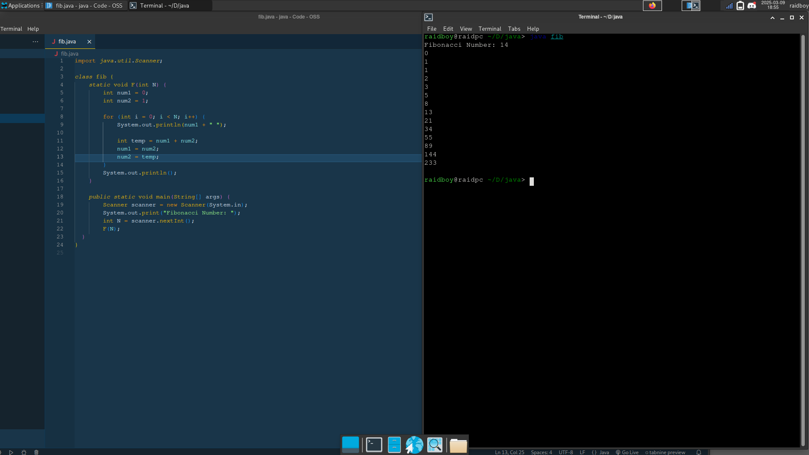

# Fibonacci Sequence

The Fibonacci sequence is a series of numbers where each term is the sum of the two preceding ones, starting from 0 and 1. Mathematically, it is defined by the recurrence relation:
F(n)=F(n−1)+F(n−2)
F(n)=F(n−1)+F(n−2)

with initial conditions:
F(0)=0,F(1)=1
F(0)=0,F(1)=1

The sequence begins as follows: 0, 1, 1, 2, 3, 5, 8, 13, 21, …

It has applications in computer science, mathematics, and nature, appearing in biological settings such as branching in trees, the arrangement of leaves, and the spirals of shells. The ratio between consecutive Fibonacci numbers approximates the golden ratio (𝜙 ≈ 1.618), which is often associated with aesthetics and natural proportions.

# Compiling

javac fib.java

java fib

# Example

